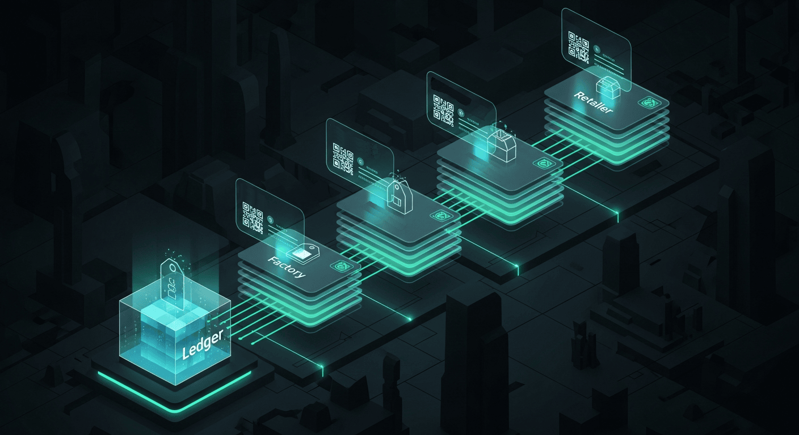

# Supply Chain Provenance System

## Overview
Docs-only case study of a supply chain provenance system designed for end-to-end traceability, tamper-evidence, and audit-ready integrity. Covers the provenance data model, event capture/validation, integrity mechanisms, and interoperability for real-world integrations.

## Start here
**[Open the Documentation Index](./docs/00-index.md)**

## Documentation
- [00 — Index](./docs/00-index.md)
- [01 — System Overview](./docs/01-system-overview.md)
- [02 — Provenance Data Model](./docs/02-provenance-data-model.md)
- [03 — Event Capture & Validation](./docs/03-event-capture-and-validation.md)
- [04 — Tamper-Evidence & Integrity](./docs/04-tamper-evidence-and-integrity.md)
- [05 — Interoperability & Integrations](./docs/05-interoperability-and-integrations.md)
- [06 — Operations, Compliance & Governance](./docs/06-operations-compliance-and-governance.md)

## Notes
- No proprietary source code included.
- Relative links are used so everything opens correctly from the repo root.
